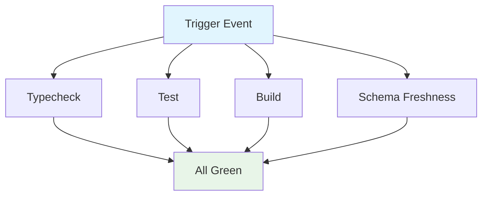

## Workflow Overview

**Purpose**: Validate code correctness, type safety, build integrity, and schema freshness on every push to `main` and every pull request targeting `main`.
**Trigger Events**: `push` to `main`, `pull_request` targeting `main`
**Target Environments**: CI (Ubuntu runners)

## Execution Flow Diagram



All four jobs run in parallel with no inter-job dependencies.

## Jobs & Dependencies

| Job | Purpose | Dependencies | Execution Context |
|-----|---------|--------------|-------------------|
| `typecheck` | Run strict TypeScript compilation check (`tsc --noEmit`) | None | ubuntu-latest, Node {20, 22} |
| `test` | Run Vitest unit/integration test suite | None | ubuntu-latest, Node {20, 22} |
| `build` | Run full build (schema generation + tsup bundle), verify outputs | None | ubuntu-latest, Node {20, 22} |
| `schema-freshness` | Regenerate JSON schemas, fail if checked-in schemas are stale | None | ubuntu-latest, Node 22 |

## Requirements Matrix

### Functional Requirements

| ID | Requirement | Priority | Acceptance Criteria |
|----|-------------|----------|---------------------|
| REQ-001 | TypeScript strict-mode compilation passes | High | `tsc --noEmit` exits 0 |
| REQ-002 | All Vitest tests pass | High | `vitest run` exits 0, no test failures |
| REQ-003 | Build produces CLI and MCP entry points | High | `dist/cli.js` and `dist/mcp.js` exist after build |
| REQ-004 | Checked-in JSON schemas match source-of-truth Zod definitions | High | `git diff --exit-code schemas/` exits 0 after regeneration |
| REQ-005 | CI runs on both supported Node versions | Medium | Matrix includes Node 20 and 22 |
| REQ-006 | Stale CI runs are cancelled | Medium | Concurrency group cancels in-progress runs for same ref |

### Security Requirements

| ID | Requirement | Implementation Constraint |
|----|-------------|--------------------------|
| SEC-001 | Workflow uses read-only permissions | `permissions: contents: read` at workflow level |
| SEC-002 | Dependencies locked | `pnpm install --frozen-lockfile` prevents lockfile mutation |
| SEC-003 | No secrets required | Workflow uses no repository secrets |

### Performance Requirements

| ID | Metric | Target | Measurement Method |
|----|--------|--------|--------------------|
| PERF-001 | Total CI wall-clock time | < 5 minutes | GitHub Actions duration |
| PERF-002 | Redundant run elimination | No duplicate runs for same ref | Concurrency group cancellation |

## Input/Output Contracts

### Inputs

```yaml
# Repository Triggers
branches: [main]
events: [push, pull_request]

# Runtime
node-version: [20, 22]  # Matrix values
packageManager: pnpm@11.7.0  # Via corepack
```

### Outputs

```yaml
# Job: build
dist/cli.js: file   # CLI entry point bundle
dist/mcp.js: file   # MCP server entry point bundle

# Job: schema-freshness
schemas/*.schema.json: file  # Must match regenerated output
```

### Secrets & Variables

| Type | Name | Purpose | Scope |
|------|------|---------|-------|
| — | — | No secrets required | — |

## Execution Constraints

### Runtime Constraints

- **Timeout**: GitHub Actions default (6 hours; individual jobs typically complete in < 3 minutes)
- **Concurrency**: One active run per branch/PR; stale runs cancelled
- **Resource Limits**: Default GitHub-hosted runner resources

### Environmental Constraints

- **Runner Requirements**: `ubuntu-latest` (C++ toolchain for `better-sqlite3` native build)
- **Network Access**: Registry access for `pnpm install`
- **Permissions**: Read-only checkout

## Error Handling Strategy

| Error Type | Response | Recovery Action |
|------------|----------|-----------------|
| Type error | Job fails, PR blocked | Developer fixes type errors |
| Test failure | Job fails, PR blocked | Developer investigates and fixes test |
| Build failure | Job fails, PR blocked | Developer fixes build configuration or source |
| Stale schemas | Job fails, PR blocked | Developer runs `pnpm schemas` and commits updated schemas |
| Lockfile mismatch | Install fails, job fails | Developer runs `pnpm install` locally and commits updated lockfile |
| Native build failure | Install fails, job fails | Check `better-sqlite3` compatibility with runner toolchain |

## Quality Gates

### Gate Definitions

| Gate | Criteria | Bypass Conditions |
|------|----------|-------------------|
| Type Safety | `tsc --noEmit` exits 0 | None |
| Test Suite | All Vitest tests pass | None |
| Build Integrity | `dist/cli.js` and `dist/mcp.js` exist | None |
| Schema Freshness | No diff in `schemas/` after regeneration | None |

## Monitoring & Observability

### Key Metrics

- **Success Rate**: Target > 95% (failures should indicate real issues)
- **Execution Time**: Target < 5 min wall-clock
- **Resource Usage**: Default runner monitoring

### Alerting

| Condition | Severity | Notification Target |
|-----------|----------|---------------------|
| CI failure on `main` push | High | Repository collaborators (GitHub default) |
| CI failure on PR | Medium | PR author (GitHub default) |

## Integration Points

### External Systems

| System | Integration Type | Data Exchange | SLA Requirements |
|--------|------------------|---------------|------------------|
| npm registry | Dependency install | Package tarballs | Available during install |
| GitHub | Source checkout, status checks | Git objects, commit status | Available during workflow |

### Dependent Workflows

| Workflow | Relationship | Trigger Mechanism |
|----------|--------------|-------------------|
| — | No dependent workflows in v1 | — |

## Edge Cases & Exceptions

### Scenario Matrix

| Scenario | Expected Behavior | Validation Method |
|----------|-------------------|-------------------|
| Lockfile out of sync | `--frozen-lockfile` fails the install step | Push with stale lockfile |
| New Zod schema added without running `pnpm schemas` | Schema freshness job fails on diff | PR with new schema, no regeneration |
| `better-sqlite3` version bump breaks native build | Install step fails | Dependency update PR |
| Concurrent pushes to same branch | Earlier run cancelled, latest runs | Push twice in quick succession |

## Validation Criteria

### Workflow Validation

- **VLD-001**: All four jobs must pass for a PR to be merge-ready
- **VLD-002**: Node 20 and Node 22 matrix entries must both pass
- **VLD-003**: Schema freshness check detects any drift between Zod source and JSON output

### Performance Benchmarks

- **PERF-001**: Individual job execution < 3 minutes
- **PERF-002**: Full workflow wall-clock < 5 minutes (parallel jobs)

## Change Management

### Update Process

1. **Specification Update**: Modify this document first
2. **Review & Approval**: PR review by repository collaborators
3. **Implementation**: Apply changes to `.github/workflows/ci.yml`
4. **Testing**: Verify on a feature branch before merging
5. **Deployment**: Merge to `main`

### Version History

| Version | Date | Changes | Author |
|---------|------|---------|--------|
| 1.0 | 2026-06-17 | Initial specification | AI-assisted |

## Related Specifications

- [CONTEXT.md](file:///Users/jg/Repos/any-subagents/CONTEXT.md) — Domain language and entity relationships
- [package.json](file:///Users/jg/Repos/any-subagents/package.json) — Scripts, dependencies, engine requirements
